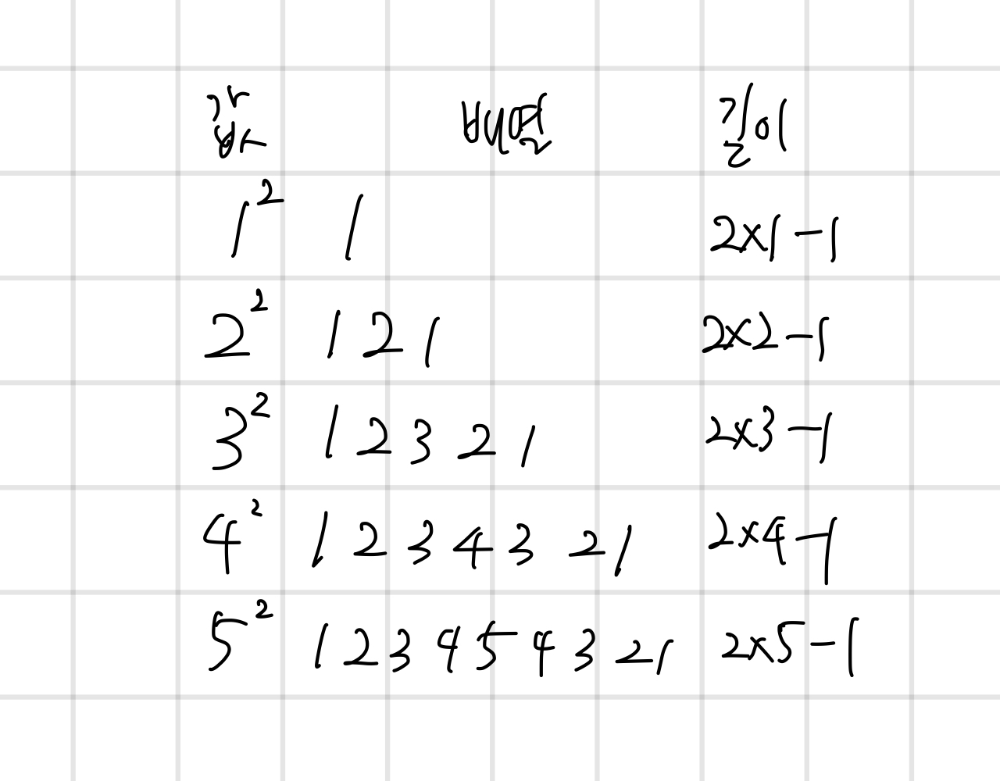

## 1011 Fly me to the Alpha Centauri

<https://www.acmicpc.net/problem/1011>

## 내가 생각한 방법

- 수학이라 쉽지 않네
  - 값이 올라갔다가 내려가는 형태의 배열인데
  - 배열의 값은 특정 수의 제곱 형태이고
  - 배열의 길이는 제곱수의 제곱근 \* 2 - 1이다
  - 이를 이용해서 초기 값을 구하고
  - 남아있는 값에 대해서 다시 길이 계산을 하는데
    - 남은 값보다 작으면 숫자 하나만 더해도 커버 가능
    - 아니면 2개 더해야 함(더 윗 자리수)
