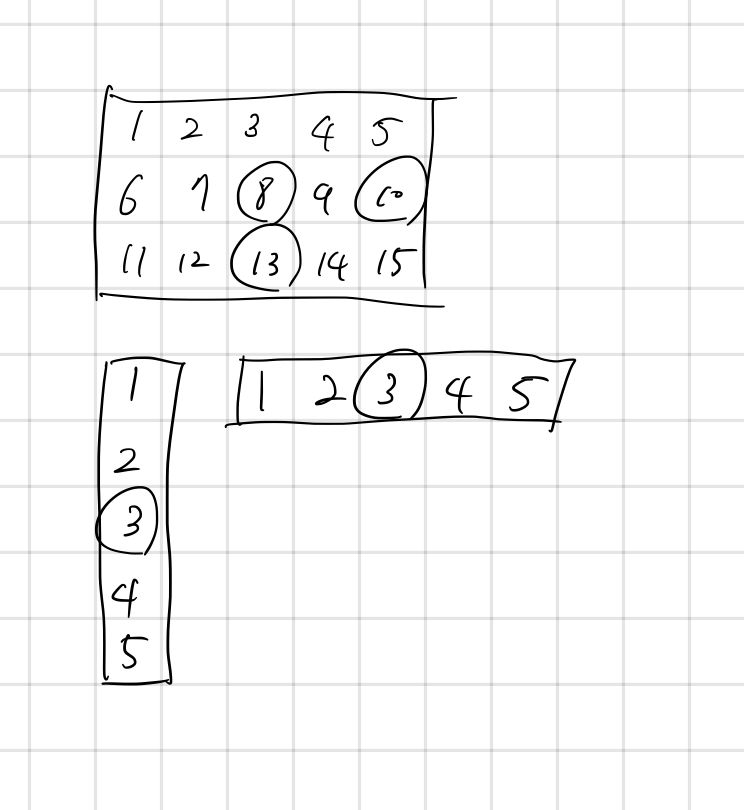

## 10164 격자상의 경로

<https://www.acmicpc.net/problem/10164>

## 내가 생각한 방법

- 경로 갯수는 격자 상에서 경로 갯수 구하는 것 그대로 이용하면 됨
  - 이게 나름 DP 방식이었구나
- K가 있을 때는 해당 좌표까지의 경로 갯수 \* 좌표에서 끝점까지 경로 갯수 곱하면 됨
- 근데 길이가 M이나 N이 1인 엣지 케이스를 고려해주어야 함
  - 여기에서 시간 좀 많이 잡아먹힘
