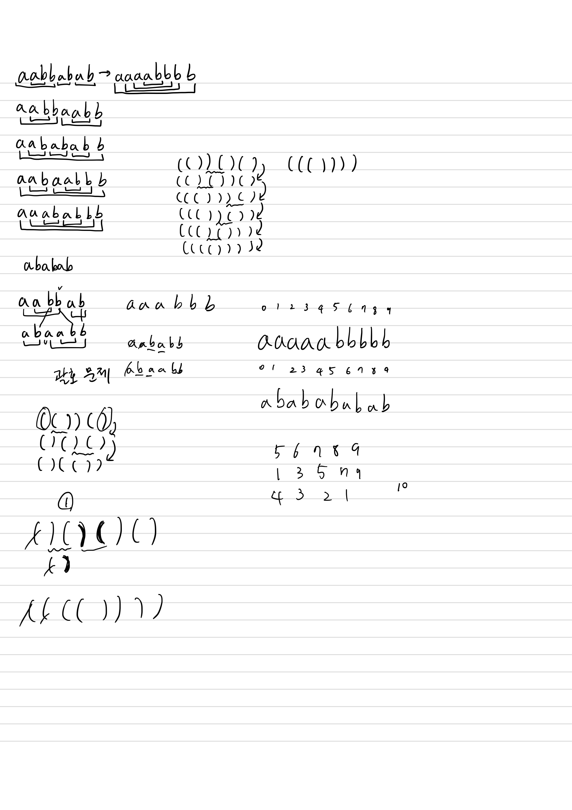

## 10453 문자열 변환

<https://www.acmicpc.net/problem/10453>

## 내가 생각한 방법

- 괄호 맞추기랑 비슷한 거라고 생각함
  - 스택으로 푸는 문제라 판단했다가 시간 엄청 날림
- 처음에 커서 기반으로 풀려고 했다가 반례 생각 못해서 엄청 틀림
  - 단순히 인덱스의 값이 같다고 해서 누적시키면 안됨.
    - 반례: `aababb abaabb`
    - 따라서 b인지 판단한 후 넣어야 함.
