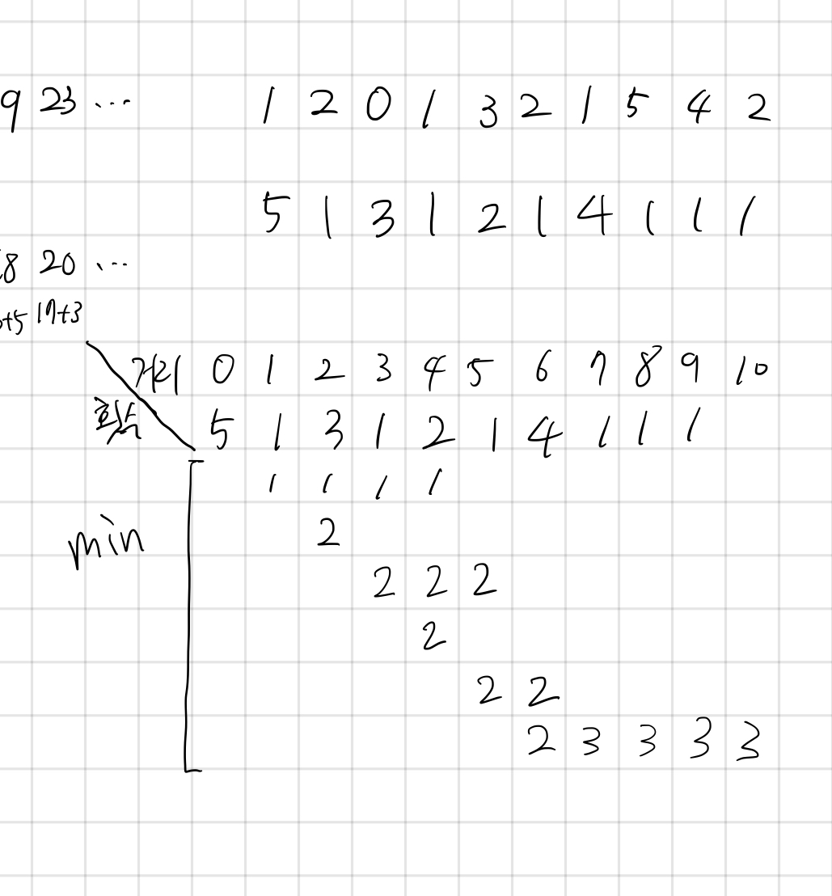

## 11060 점프 점프

<https://www.acmicpc.net/problem/11060>

## 내가 생각한 방법

<!--  -->

- DP로 풀면 간단한건데 이걸 그리디로 생각해버렸다
- 가로축을 거리, 세로축을 최소횟수로 생각하면 풀 수 있다
  - 도달할 수 있는 좌표들 dp를 일단 무한으로 둔다
  - 현재 좌표에서 도달할 수 있는 좌표들에 대해 dp에 `+1` 한 것을 적용해본다
  - 최소값일 경우만 갱산한다

## 테스트케이스

```
1
0
0
```

```
10
1 2 0 1 3 2 1 5 4 2
5
```

```
5
4 0 0 0 1
1
```

```
10
4 0 3 0 4 0 3 0 4 0
3
```

```
10
4 0 0 0 0 0 0 0 0 4
-1
```

```
5
2 3 1 1 0
2
```

```
10
5 1 3 1 2 1 4 1 1 1
```
