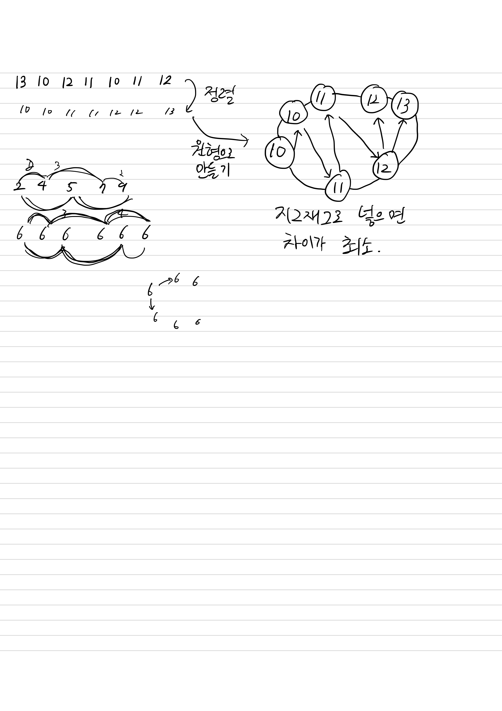

## 11497 통나무 건너뛰기

<https://www.acmicpc.net/problem/11497>

## 내가 생각한 방법

- 주어진 배열을 정렬해서 푸는 문제라고 생각
  - 인접한 통나무 사이의 높이 차이를 최소화 해야하는데,
  - 원형으로 만들기 때문에 지그재그로 넣으면 됨
- 인덱스로 나타내면 처음을 제외하고는 2씩 차이가 나기 때문에 해당 규칙을 이용해 `max`를 계속 계산해 나가면서 품
