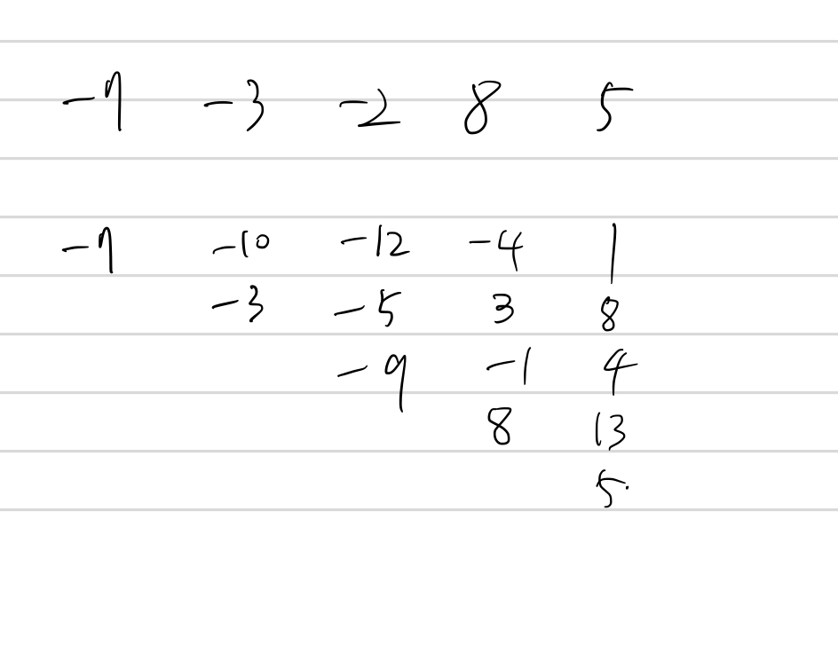

## 1182 부분수열의 합

<https://www.acmicpc.net/problem/1182>

## 내가 생각한 방법

- DP인가 싶었는데 브루트포스로 구함
  - 처음에 문제를 잘 못 이해해서 DP로 푸는 것인줄 알았음
  - 누적값을 계속 더해가면서...
  - 첨부한 이미지 반례로 시작하면 해당 반례 생기는 거 막을 수 있음
- 각 숫자를 순회하면서, 덧셈한 값을 누적시킴
- 이때 횟수는 딕셔너리(해시)에 별도로 저장하기 때문에 숫자 중복되어도 문제 없음
  - 배열에 누적하기 전에, 새로 구한 값만 횟수를 추가함!
