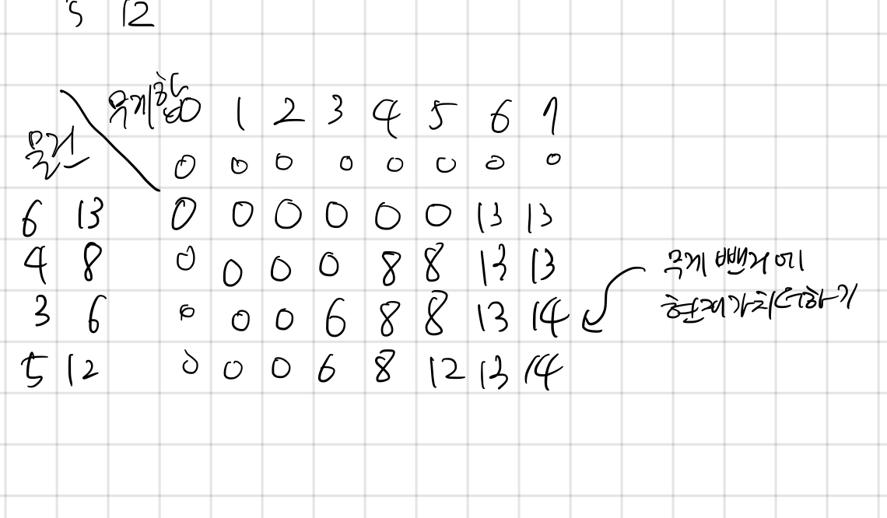

## 12865 평범한 배낭

<https://www.acmicpc.net/problem/12865>

## 내가 생각한 방법

- 냅색 문제 => 쪼갤 수 있으면 그리디, 아니면 이중 DP로 품.
- 일단 유형에 대해서 기억이 안나서; 유형은 보고 품.
- 가로축은 무게, 세로축은 각 물건
  - 무게 별, 물건 별 반복문 돌림
    - 각 물건의 무게와 가치를 꺼냄
    - 만약 현재 무게부터 물건 담을 수 있다면?
      - DP 위의 칸(이미 최대값으로 판정난 것), 그리고 현재 물건 무게를 뺀 것의 최대값에서 가치를 더한 것 중 최대값 구하기.
    - 물건 못 담으면 그냥 위값 가져오기
- 이중 DP로 푸는 거였군.
