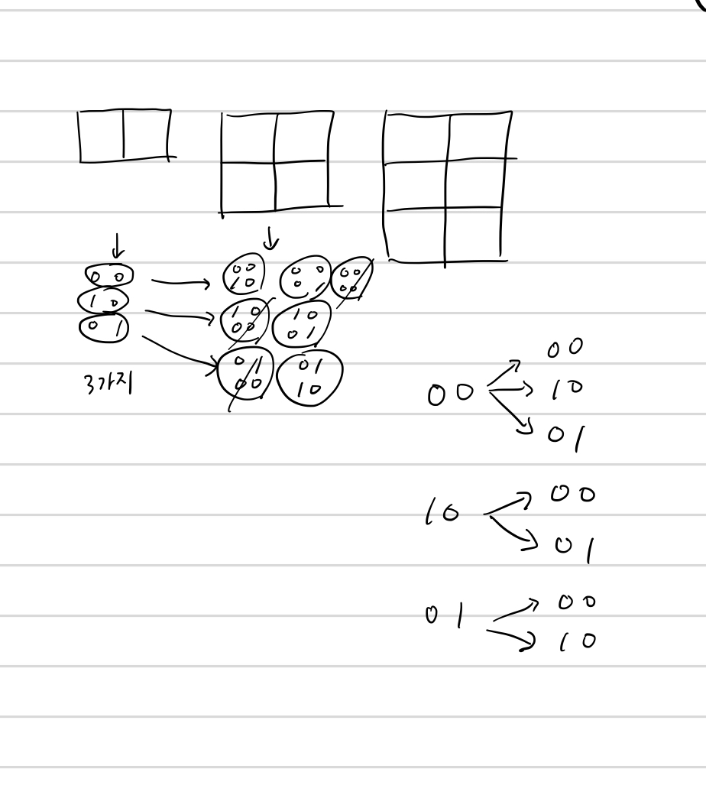

## 1309 동물원

<https://www.acmicpc.net/problem/1309>

## 내가 생각한 방법

- DP임을 바로 알아차렸다
  - DP로 설정할 것은 높이에 따라 배치할 수 있는 경우의 수
  - 제일 마지막 줄만 보면 된다
- 사자가 있음을 1, 없음을 0으로 생각할 때 세 가지 경우의 수만 생각할 수 있다
  - 제일 마지막 줄에 `00`이 왔을 때에는 `00`, `10`, `01` 셋 다 올 수 있다
  - `10`이 왔을 때는 `00`, `01`만. `01`의 경우도 마찬가지.
- 이 횟수를 DP로 저장해서 계산해나가면 끝
