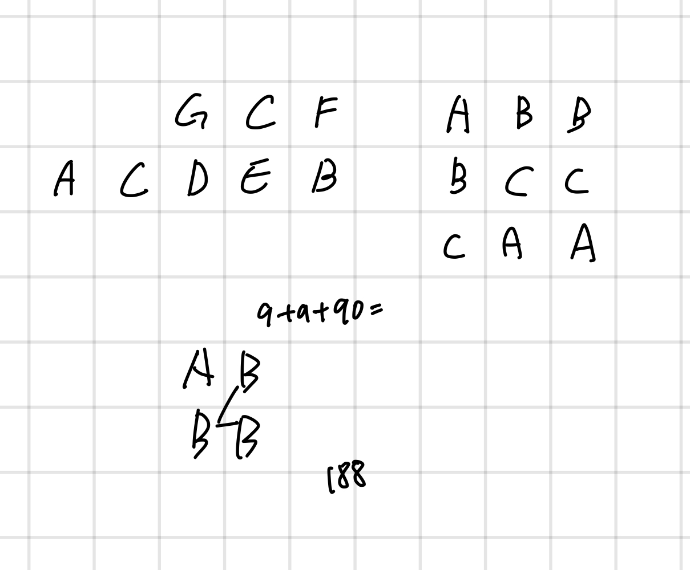

## 1339 단어 수학

<https://www.acmicpc.net/problem/1339>

## 내가 생각한 방법

- 흠... 구현 + 수학? 그리디
  - 각 알파벳 별로 9가 들어갔을 때 나올 수 있는 최대 알파벳을 구하기
  - 그러면 가중치가 나오는데 그 가중치 순서대로 9, 8, 7, ... 의 숫자를 넣으면 됨
- 어려워보였는데 바로 풀렸다
