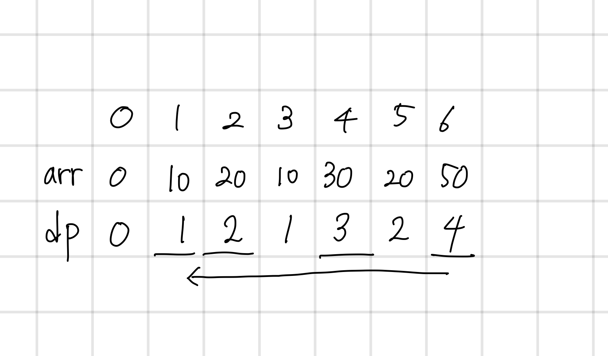

## 14002 가장 긴 증가하는 부분 수열 4

<https://www.acmicpc.net/problem/14002>

## 내가 생각한 방법

- DP
  - 원래 하던대로 해당 수보다 앞에 있으면서 작은 수 중에서 제일 큰 거 찾고 + 1
  - 순서 탐색은 뒤에서부터 찾기
    - `maximum`과 같은 값 찾고, 찾았으면 -1
    - 앞으로 나가면서 1번째 인덱스까지 반복
