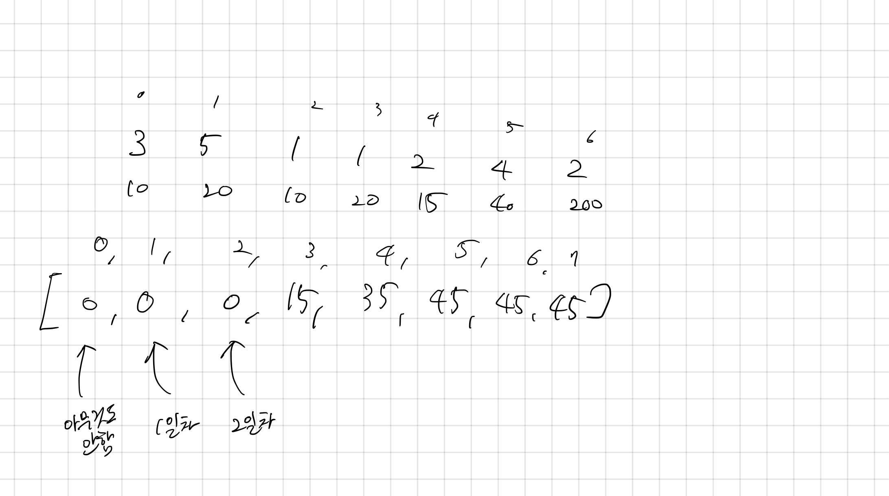

## 14501 퇴사

<https://www.acmicpc.net/problem/14501>

## 내가 생각한 방법

- DP로 푸는 걸 생각해내지 못했다
  - 거꾸로 인덱스를 세는데, `오늘 일해서 벌 수 있는 돈 + 일하는데 걸리는 시간을 뺀 값까지의 DP`과 `dp[-1]` 를 계산해야 해서 복잡하다
  - 거꾸로 인덱스를 세다보니 헷갈렸던 문제
