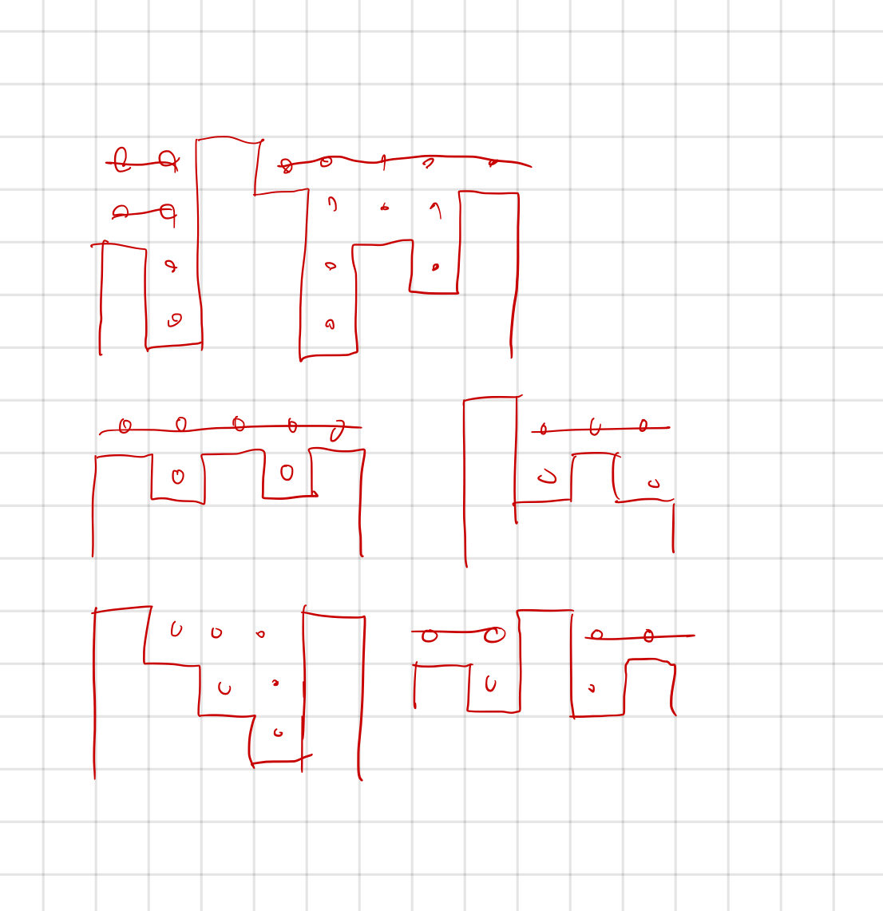

## 14719 빗물

<https://www.acmicpc.net/problem/14719>

## 내가 생각한 방법

<!--  -->

- 그냥 구현 문제
- 주어진 높이대로 그래프를 만듦
  - 높이만큼 벽(`1`)을 세우고
  - 나머지는 물(`2`)로 채움
- 물 칸을 탐색하면서
  - 왼쪽, 오른쪽 중에 벽이 하나라도 없다면 물이 샌다는 뜻
  - 이 때는 빈 칸(`0`)으로 만듦
  - 왼쪽에 이미 빈 칸이 있다면 해당 칸 역시 빈 칸으로 만듦
