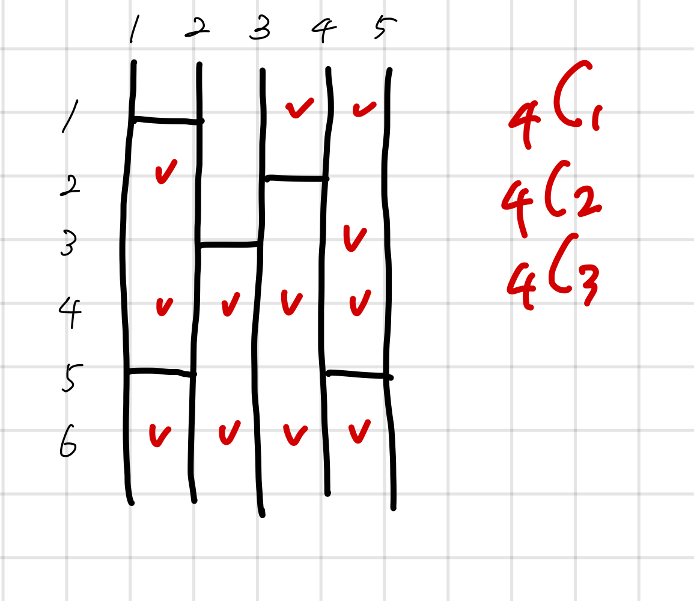

## 15684 사다리 조작

<https://www.acmicpc.net/problem/15684>

## 내가 생각한 방법

- 모든 경우 탐색해야 하니까 백트래킹
  - ...으로 하려고 했는데 너무 힘들어서 그냥 조합으로 풂
- 최종 방법
  - 사다리 가로 놓인 건 배열로 관리함.
  - i 좌표가 i로 가는지는 검사하는 함수 미리 만들어놓기
  - 새로 놓을 수 있는 좌표 후보군을 미리 뽑아놓음
    - 기존에 놓여져 있는 가로 사다리에서 좌, 우에 닿지 않는 거만 뽑으면 됨
  - 그 후 후보군에서 조합으로 0개, 1개, 2개, 3개 뽑아서 놓기
    - 단 이 때에도 새로 뽑을 수 있는 후보군에서 좌, 우에 있는 가로 사다리 좌표 빼야 함
- 하 어렵다!
