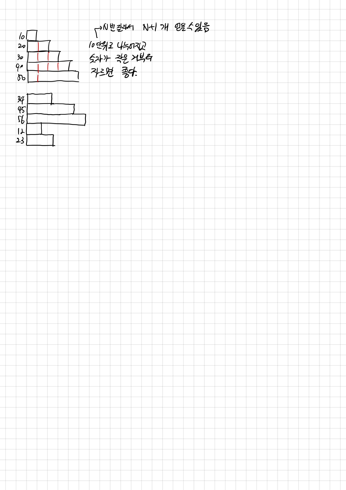

## 16206 롤케이크

<https://www.acmicpc.net/problem/16206>

## 내가 생각한 방법

- 10 단위를 먼저 잘라야 한다.
  - 왜? N번 잘라서 N+1개를 얻을 수 있기 때문
    - ex) 20은 1번 잘라서 10개를 두 개 얻음
  - 10 단위를 먼저 자르고, 그 중에서도 숫자가 작은 것들부터 잘라야 함
    - 단순 숫자 10은 자르는 횟수를 소모하지 않고도 획득 가능
- 우선순위 큐를 사용했다
  - 10으로 나눠지는 것은 Priority를 음수로 주어서 더 앞으로 오게 함
    - 더 작은 숫자가 앞으로 오도록 역함수를 씀
  - 10으로 나누어지지 않는 것은 Priority를 그냥 줌
