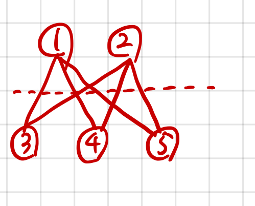

## 1707 이분 그래프

<https://www.acmicpc.net/problem/1707>

## 내가 생각한 방법

- 순환 그래프가 아닌 걸 찾는 것 같음. 근데 아니었네?
  - 반례가 있네?
  - 순환 길이가 홀수 길이가 아니면 됨
- 생각한 방법은 DFS로 탐색하면서 턴(turn)을 저장함
  - 인접한 노드를 탐색하는데...
  - 방문 안한 노드라면 바로 DFS 타고 탐색 시작. 턴은 1 증가시킴
  - 이미 방문한 노드를 만난다면
    - 현재 턴과 비교해서 그 차가 짝수면 홀수 순환이 생긴다고 판단
    - 해당 노드로 넘어가야 홀수니까
- 근데 시간 초과가 뜸.
  - 일단 리커전을 횟수 제한을 풀어둠
  - u, v 같은 경우 제외 (큰 의미는 없지만)
  - False 가 나오는 순간 연쇄 return
  - 모든 노드에 대해 BFS 돌리되, 탐색 안한 노드부터 챙김
