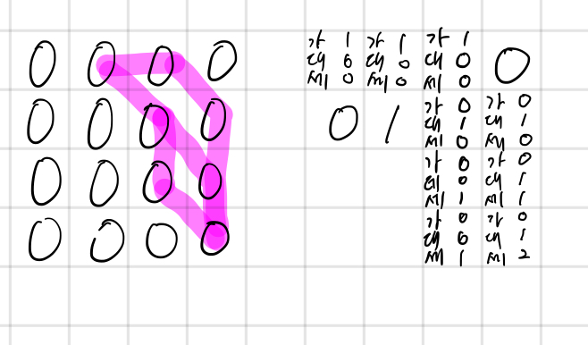

## 17070 파이프 옮기기 1

<https://www.acmicpc.net/problem/17070>

## 내가 생각한 방법

- DFS인지 DP인지 헷갈렸지만, DFS로 하면 아무리봐도 시간 초과가 날 것 같아서 DP로 풀었음
- 모든 y, 그리고 2~N까지의 x에 대해서 DP를 돌림
  - x 좌표가 0, 1인 경우는 애초에 접근조차 불가능
- 하나의 DP에는 다음과 같은 3개의 정보를 저장
  - 왼쪽에서 몇 개 경로로 접근 가능한지
  - 대각선에서 몇 개 경로로 접근 가능한지
  - 위쪽에서 몇 개 경로로 접근 가능한지
- DP를 계산할 때 벽 있는지도 체크함
