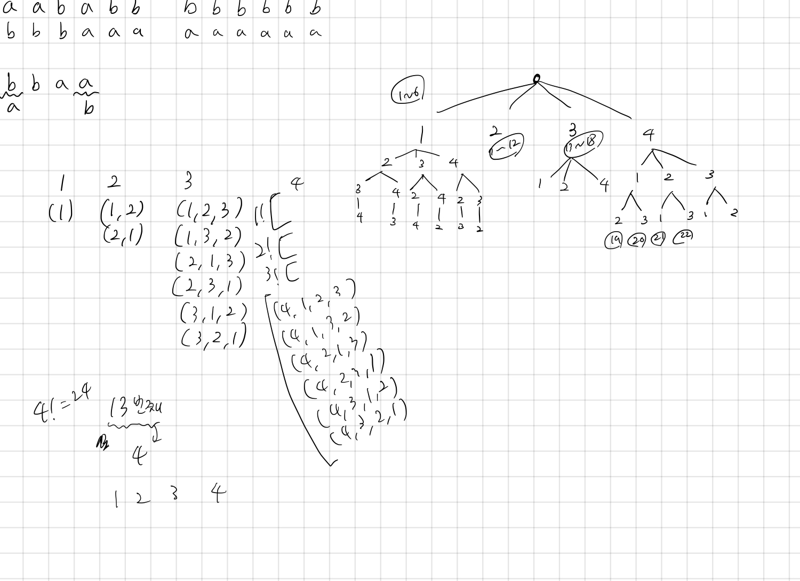

## 1722 순열의 순서

<https://www.acmicpc.net/problem/1722>

## 내가 생각한 방법

- 구현 문제? 수학 문제? DP? 뭐 이것저것 섞어 썼는데 쉽지 않았다
- 일단 DP로 `20!`까지 숫자는 미리 구해놓음
- 핵심은 순열이기 때문에 숫자를 꺼내 쓰는 것.
  - 일단 `[1, 2, 3, 4, ...]` 이런 식으로 정렬된 숫자 배열 만듦
- K번째 인덱스의 수열 알아내기
  - 만약 `4!` 이라는 수열이 주어졌다면 처음에는...
    - `1~6`번째 인덱스까지는 1로 시작하고, `7~12` 번째 인덱스는 2로, `13~18`은 3으로 시작, `19~24`는 4로 시작할 것이다
    - 왜냐하면 `3!` 이 총 4개 있기 때문
    - 우리가 알고 싶은 인덱스가 13번째라면 처음 숫자가 3으로 시작하는 것을 알 수 있다
    - 그래서 처음 숫자에 `3`을 넣음
    - 3을 꺼내썼기 때문에, 숫자 배열에서 3을 지움. 따라서 숫자 배열은 `[1, 2, 4]`이 된다
    - 그 후 범위를 좁혀 계속 진행해야 하는데, 누적값을 관리해주어야 함. 이를 `acc` 로 계산. 누적값은 몇 번째로 오는 숫자인지 계속하기 전에 계속 빼줌.
    - 이를 숫자 배열을 다 쓸때까지 반복하면 됨
- 주어진 수열의 인덱스 알아내기
  - 만약 `4!` 이라는 수열이 주어졌다면 처음에는...
    - `1~6`번째 인덱스까지는 1로 시작하고, `7~12` 번째 인덱스는 2로, `13~18`은 3으로 시작, `19~24`는 4로 시작할 것이다
  - 따라서 마치 이진탐색처럼 `left` 범위와 `right`를 알 수 있다
  - 범위를 계속 좁히면서 `left`와 `right`가 같아질 때 까지 하면 됨.
  - 대신 이 때에도 숫자 중복해서 쓰지 않도록 숫자 배열로 관리해야 함
- 복잡하다.
