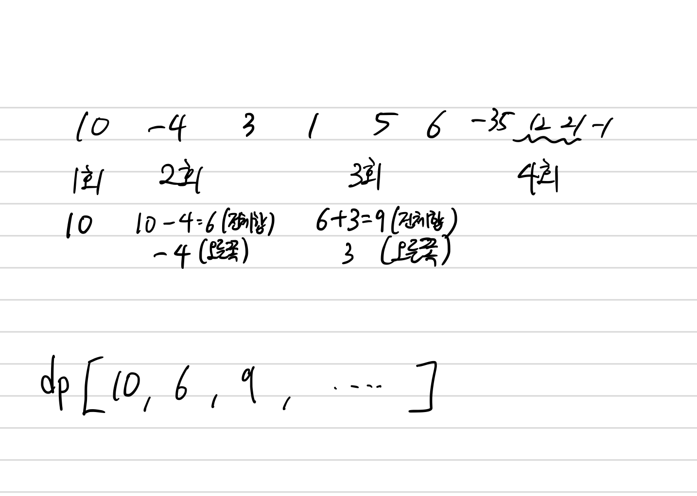

## 1912 연속합

<https://www.acmicpc.net/problem/1912>

## 내가 생각한 방법

- DP인 것은 알아차렸지만 접근을 잘 못 해서 시간이 오래 걸림
  - 특정 인덱스까지의 최대값을 DP로 걸면...
  - 값을 계속 누적해서 구해야 해서 시간 초과가 걸림
- 특정 인덱스까지 선택했을 때 나올 수 있는 값을 DP로 계산하면...
  - 해당 값 중에서 `max`를 거는 방식으로 해결 가능
