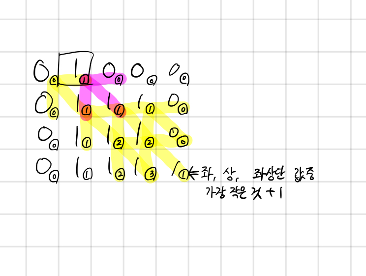

## 1915 가장 큰 정사각형

<https://www.acmicpc.net/problem/1915>

## 내가 생각한 방법

- 완전 탐색이나 그래프 탐색 밖에 생각이 안났는데 DP로 푸는 문제였다.
- 점화식 세울 때 상당히 헷갈림, 하지만 이해하고 나면 쉬운 문제
  - 0은 무조건 DP값이 0
  - 1은 DP값 1로 초기화 함
  - 그 후 맵 순회하면서 좌단, 상단, 좌상단 값에서 가장 작은 값에 1 더한거 적용해줌
