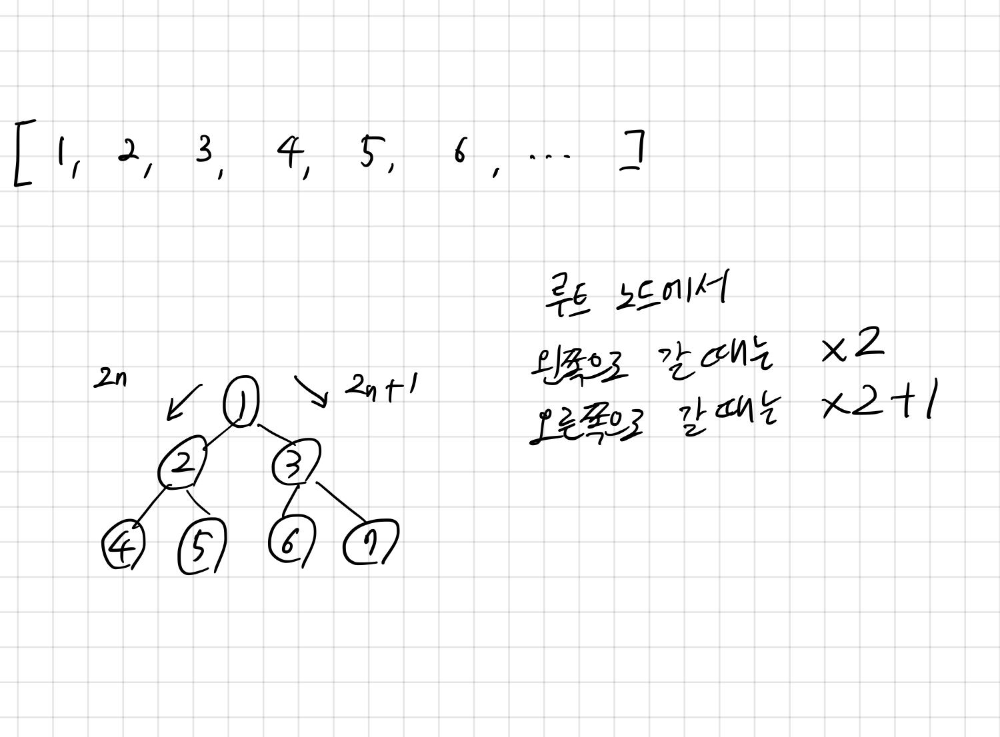

## 20364 부동산 다툼

<https://www.acmicpc.net/problem/20364>

## 내가 생각한 방법

- 완전 이진 트리의 인덱스 접근 순서를 알고 있으면 쉽게 풀 수 있다
- 이동 경로 같은 경우는 목적지로부터 거꾸로 접근함
  - 홀수일 때는 1 빼고 2로 나눔
  - 짝수일 때는 2로 나눔
  - 1에 도착했을 때 `reverse`
- 점유 중인지를 나타내는 배열을 하나 추가해서 관리함
