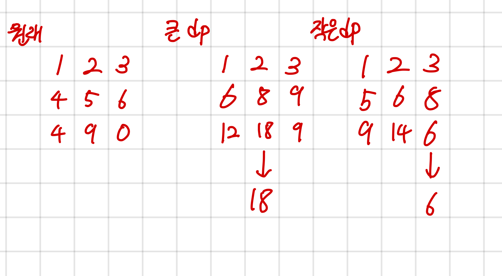

## 2096 내려가기

<https://www.acmicpc.net/problem/2096>

## 내가 생각한 방법

- DP만 생각했는데 메모리 제한이 있어서 따로 처리해줌
  - 입력 받는 즉시 max_dp랑 min_dp 갱신하는 방식
  - 유형은 슬라이딩 윈도우라고 하는데 뭐 그냥 받자마자 처리하는 식으로 해서 딱히 그렇게 풀진 않음
- DP 자체는 매우 쉬운 유형
  - 2 \* 3 배열 두 개 만들고 작은 거 계산하는 DP, 큰 거 계산하는 DP 하나 따로 둠
