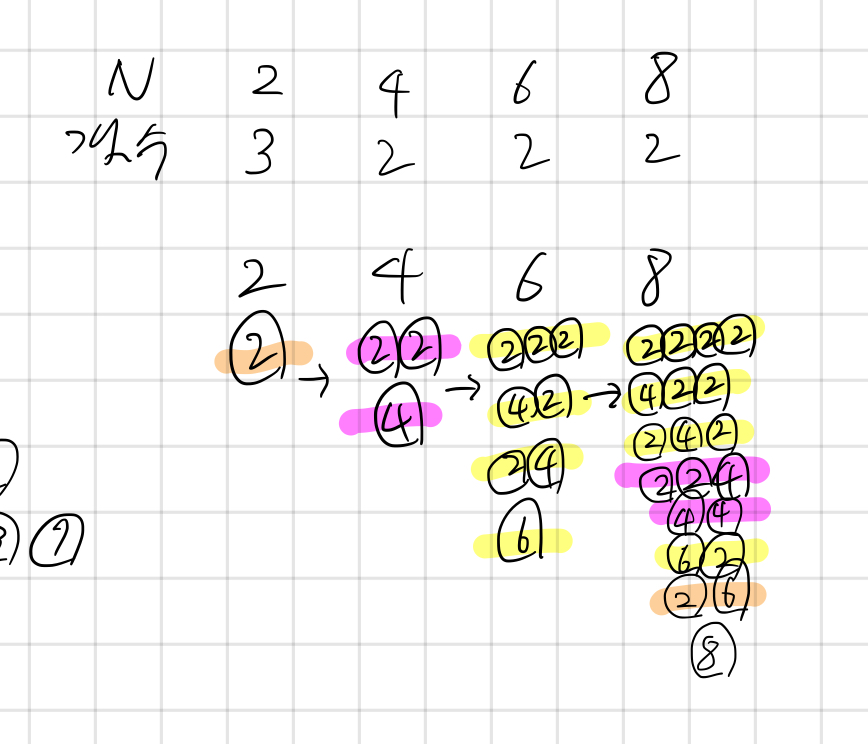

## 2133 타일 채우기

<https://www.acmicpc.net/problem/2133>

## 내가 생각한 방법

- DP 같긴 한데 DP 맞네
- 일단 N이 홀수일 때는 못 만들기 때문에 예외처리
- N이 2일때, 블록 3개 만들수 있고 4 이상부터는 2개만 만들 수 있음
- 나는 점화식은 안 세우고 몇 개짜리 블록들의 집합으로 구할 수 있는지를 생각함
  - 즉 N이 6이라면, `2개짜리 블록 * 3` 또는 `4개짜리 블록 * 1 + 2개짜리 블록 * 1`, `6개짜리 블록 * 1` 이런 식으로
- 그러면 N번 째 블록 갯수는 `N - 2번째 블록에 2개짜리 블록 하나 더한 거`, `N - 4번째 블록에다가 4개짜리 블록 하나 더한 거`, ... 이런 식의 합이 됨
- N은 최대 30까지이므로 미리 구해놓고 계산 끝
