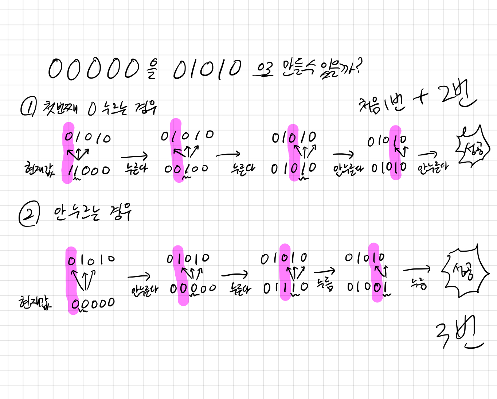

## 2138 전구와 스위치

<https://www.acmicpc.net/problem/2138>

## 내가 생각한 방법

- 처음에 너비우선탐색인가 싶었는데, 아무리봐도 시간 복잡도로 불가능해보였다
- 아이디어는 첫 전구의 케이스를 나누어 하나씩 순차 탐색하는건데... 시간 내에 떠올리지 못했다
- 아이디어에 대한 이해를 하고 난 후에는 직접 구현함.
  - 스트링 토글하는 함수 짜느라 시간이 걸림
