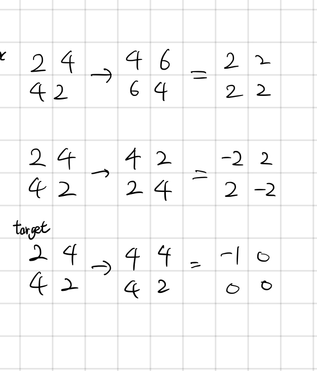

## 22352 항체 인식

<https://www.acmicpc.net/problem/22352>

## 내가 생각한 방법



- 두 그래프의 차이를 계산했을 때, 0이 아닌 덩어리들이 0개 또는 1개일 때 YES를 출력하면 될 듯

  - 하지만 실패! 반례가 있었다

    ```
    2 2
    2 4
    4 2
    4 6
    6 4
    ```

  - 배열 모든 원소에 2가 더해지는 경우..를 구분하지 못함!

- 해결 방법
  - 처음으로 DIFF가 생기는 곳에서 `before` 배열에서 해당 값으로 연결된 덩어리를 찾자
  - 그 값을 `after` 배열의 값으로 바꿔보자
  - 두 배열이 같다면 하나만 바뀐 거
