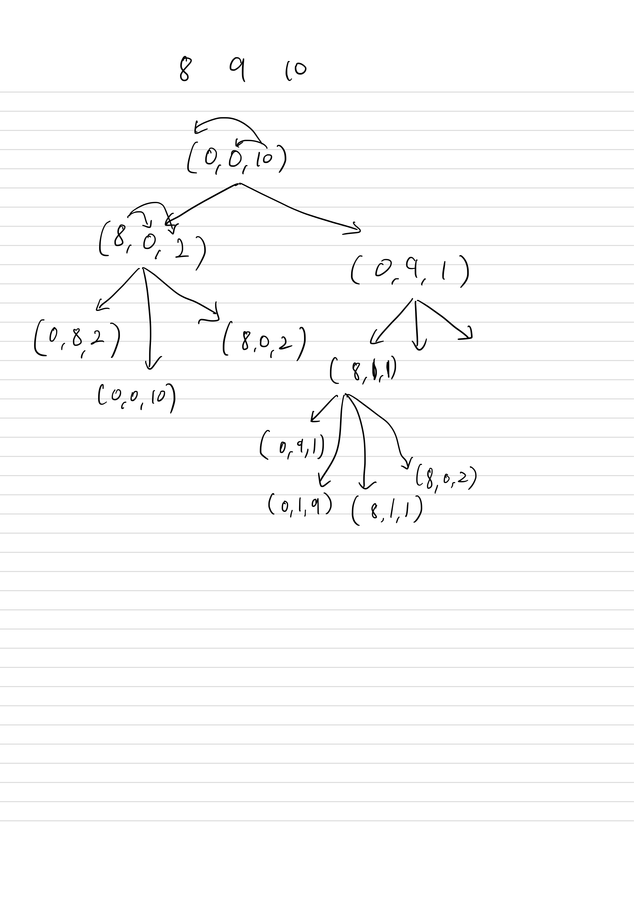

## 2251 물통

<https://www.acmicpc.net/problem/2251>

## 내가 생각한 방법

- 처음에 브루트포스로 일일이 다 찾는 것인줄 알았다...
  - 모든 경우의 수를 찾는 건 맞는데, 이 때 깊이/너비우선탐색을 써야 한다는 것은 도움을 받았다
- 인덱스 A에서 인덱스 B로 물을 옮길 수 있는지, 그리고 옮겼을 때 어떤 튜플이 생성되는지를 별도의 함수로 구현했다
- 그래서 모든 경우의 수를 다 구하고, 그 중에서 A가 0인 경우의 C값을 `set`으로 중복 제거하고 정렬해서 출력함
