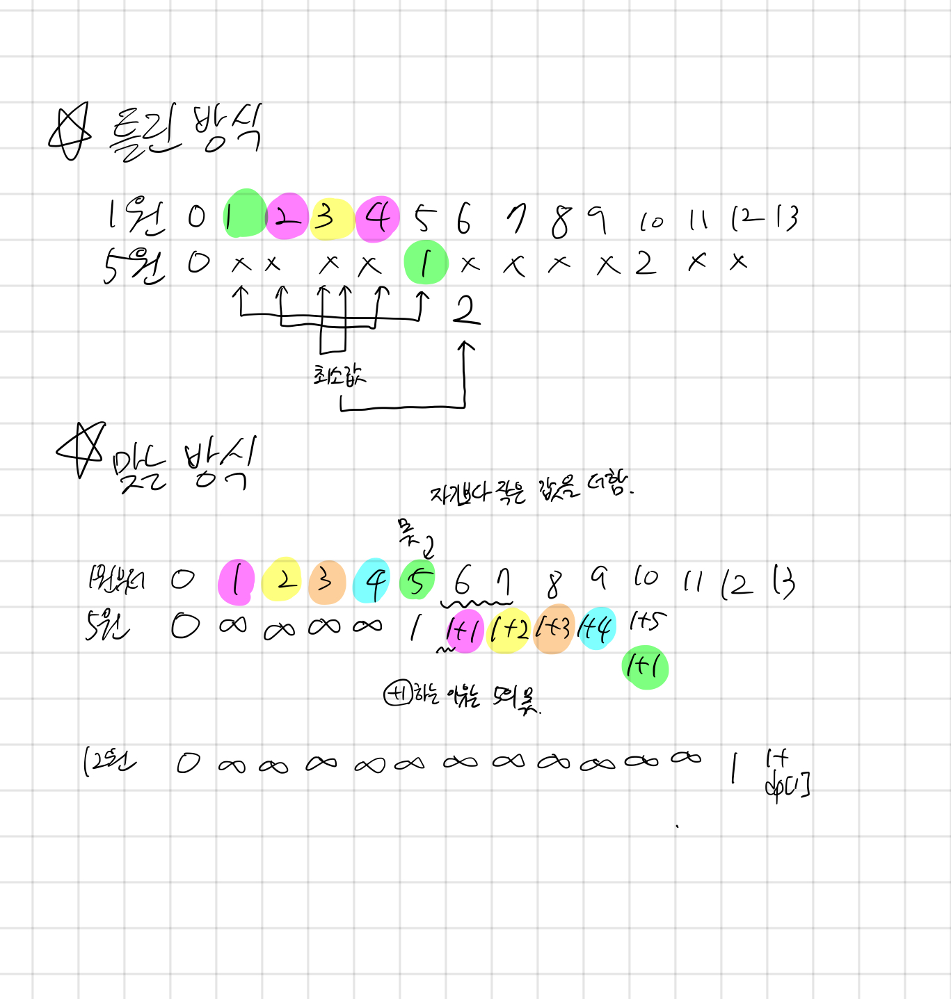

## 2294 동전 2

<https://www.acmicpc.net/problem/2294>

## 내가 생각한 방법

- DP인 것은 알았는데 예전에 비슷한 문제랑 또 비슷한 함정에 빠짐
  - N번째 최소를 구하기 위해, `min(0 + N-1, 1 + N-2, ...)` 를 구하려다가 뇌절함
  - 비슷한 문제
    - BOJ/1106 호텔
    - BOJ/14501 퇴사
- 올바른 풀이는 다른 사람 풀이 보고 획득
  - 최소값을 구하는 것이기 때문에 일단 최대값으로 채움(나는 무한으로 채움)
  - 각 동전 별로 DP를 구한다.
    - DP 가로축은 전체 비용, 세로축은 동전들
    - 이때, 현재 코인만큼 가치를 빼고, 1을 더하는 로직을 이해하자
      - 더 가성비 좋은 높은 코인을 추가하겠다는 뜻!
- 비슷한 유형을 풀었는데도 불구하고 비슷한 함정에 빠져서 아쉽다.
