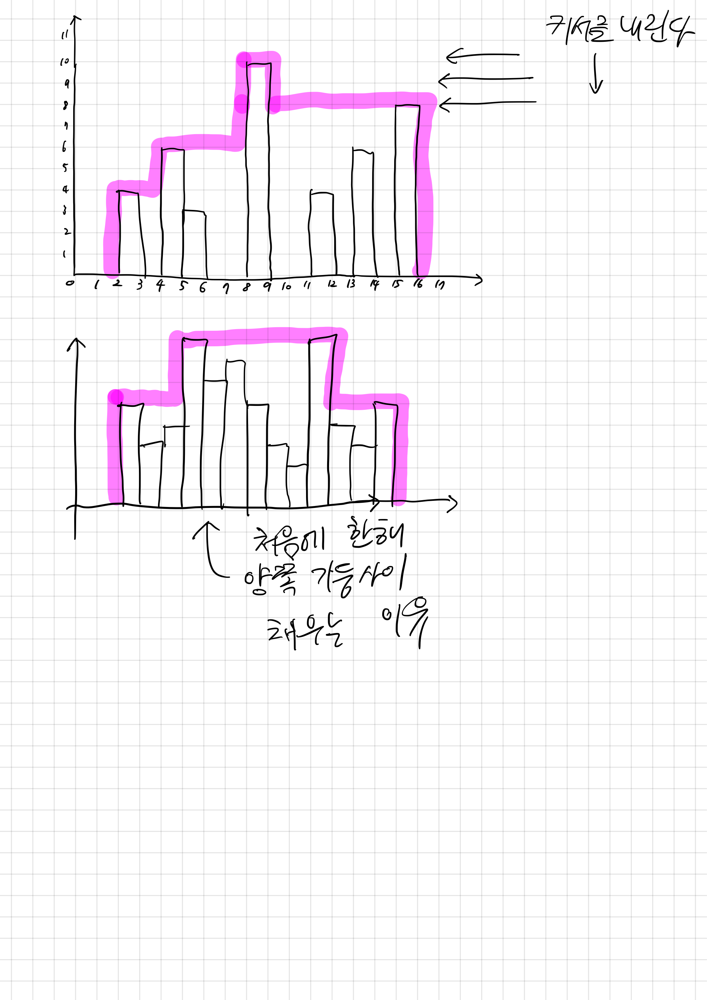

## 2304 창고 다각형

<https://www.acmicpc.net/problem/2304>

## 내가 생각한 방법

- 기둥의 높이를 기준으로 두고, 커서를 만들어 위에서부터 내려가보자
  - 이미 방문한(?) 기둥의 오른쪽이나 왼쪽에서 같은 높이의 기둥이 또 발견된다면?
  - 방문한 기둥 사이와 새 기둥 사이를 해당 높이로 메꾼다
- 왼쪽과 오른쪽 커서를 두고 좁혀나가는 커서 기반 브루트포스 방식으로 구현함
