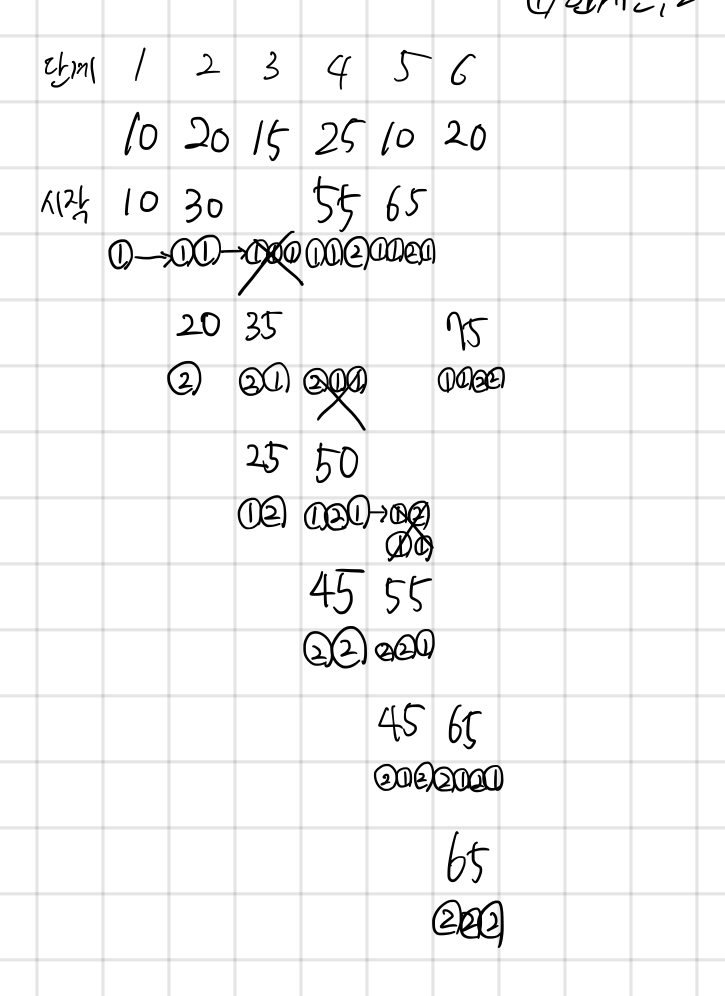

## 2579 계단 오르기

<https://www.acmicpc.net/problem/2579>

## 내가 생각한 방법



- DP로 푸는 문젠데, 메모리 초과가 나서 헷갈릴 뻔 했다.
  - 나는 경로 정보를 함께 저장했고 11, 21 같은 경우에는 1칸 더 이동하지 못하게 했다
  - 1칸 이동해서 얻은 최대값 경로와 2칸 이동해서 얻은 최대값 경로를 각각 하나씩 저장하되
  - 각 경우의 최대값만 저장하게 했다
- 근데 다른 사람 점화식 보니까 훨씬 깔끔하긴 하다

  ```py
  max(dp[n-3] + array[n-1] + array[n], dp[n-2] + array[n])
  ```

  - 도착점 기준으로 움직이는 건데, -1칸을 밟으려면 -3칸을 밟고 와야한다는 뜻
  - -2칸을 밟는 건 문제 없음
