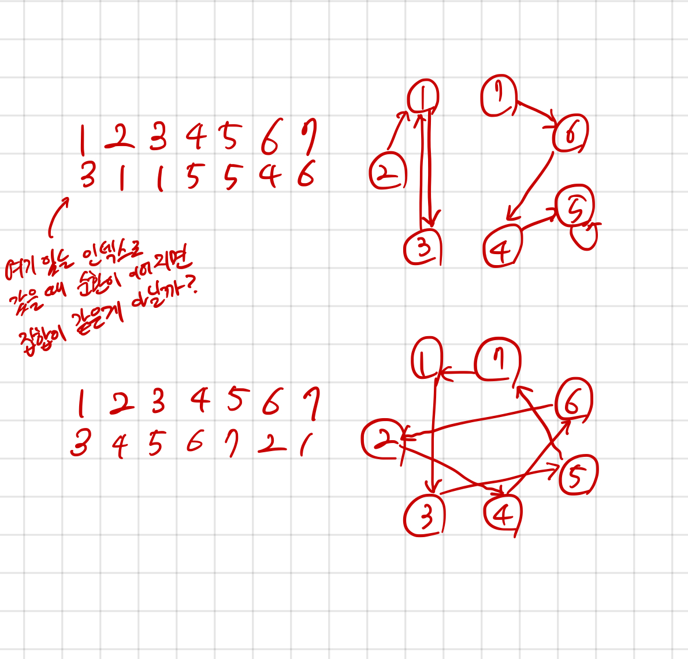

## 2668 숫자고르기

<https://www.acmicpc.net/problem/2668>

## 내가 생각한 방법

- DFS(인데 인줄 모르고 품ㅋㅋ)
- 사이클을 찾으면 될 것 같다는 생각이 들었음
  - A에서 시작한 숫자가 배열 인덱스 접근을 통해 다시 A로 반환된다면 이는 사이클, 인덱스 집합이 곧 원소 집합과 같음
  - 사이클 외부에서 접근할 수도 있음 (ex: 2 - 1 - 3 - 1 - 3 ... 이 때 2의 경우임)
  - 방문 도중 `visited`가 True인 것을 만났는데 그것이 `start` 가 아니라면, 외부에서 접근하는 경우임
- `cycle_dp`는 특정 숫자 N에서 시작했을 때 나오는 사이클의 원소 집합
  - 위에서 이야기한, `visited` True인 경우의 사이클을 DP로 저장함. 중복 계산 안하게
