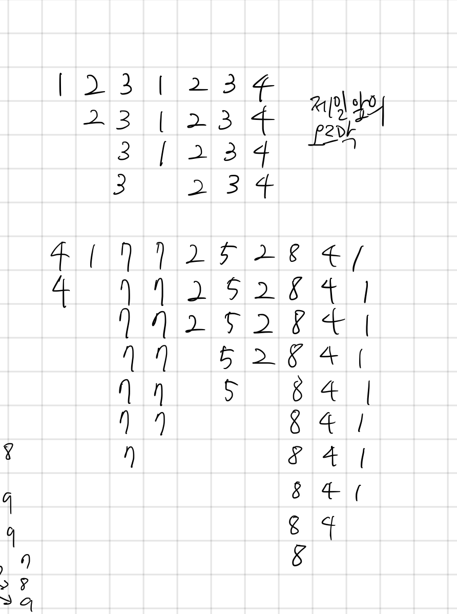

## 2812 크게 만들기

<https://www.acmicpc.net/problem/2812>

## 내가 생각한 방법

- 그리디로 푸는 건 알았는데 시간 초과가 나서 못 풀었다
- 규칙은 다음과 같음
  - 숫자를 앞에서부터 읽어나가다가 오르막을 발견하면 즉시 숫자를 지움
  - 만약 모든 숫자가 오르막이라면 뒤에서부터 지움
  - 이렇게 하면 N^2임
- 스택을 쓰면 오르막 지우는 것을 N번만에 해결 가능
