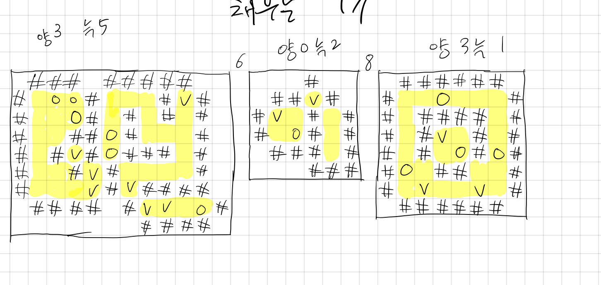

## 3184 양

<https://www.acmicpc.net/problem/3184>

## 내가 생각한 방법

- 너비 우선 탐색으로 풀 수 있다
- 일단 모든 좌표를 순서대로 탐색한다
  - 현재 좌표가 벽이 아니고, 이미 방문한 좌표가 아니라면 너비 우선 탐색을 실행한다
  - 너비 우선 탐색 함수는 붙어있는 지점의 좌표를 리스트로 반환한다
  - 탐색하면서 재방문하지 않게 `visited`도 체크함
  - 좌표를 하나씩 다시 탐색하면서 늑대랑 양 수를 체크한다
  - 이 값을 누적하면 됨!
