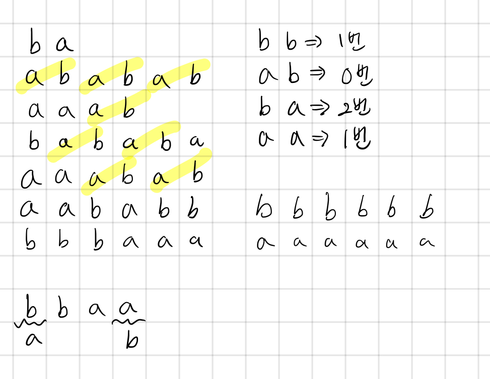

## 4889 안정적인 문자열

<https://www.acmicpc.net/problem/4889>

## 내가 생각한 방법

- 좀 복잡하게 생각했는데.. 그 정도는 아니었다
  - 나는 `{}`, `{{`, `}}`, `}{` 네 가지 경우에 대해 구함
  - `{}`는 변경 없이 바로 없앨 수 있음
  - `{{`, `}}`는 1회 변경으로 없앨 수 있음
  - `}{`는 2회 변경으로 없앨 수 있음
  - 현재까지 가장 유망한 인덱스들을 저장하고, 순회하면서 하나씩 지워나감
  - 이 때 변경 횟수를 누적해서 더해줌
- 다른 사람의 풀이를 살펴보았다
  - 일단 처음에 `}`가 오면 바꿈
  - 나머지는 스택에 넣으면서 팝해줌
  - 남는 `{`들의 절반 갯수가 답
