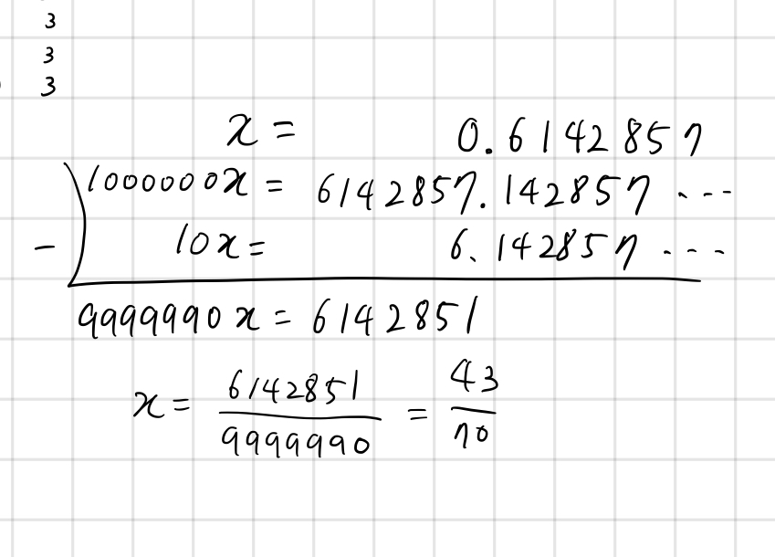

## 5376 소수를 분수로

<https://www.acmicpc.net/problem/5376>

## 내가 생각한 방법

<!--  -->

- 순환 소수에 대한 이해가 필요해서 약간 복잡하긴 한데 암산으로 풀긴 함
- 일단 순환 소수가 아닌 것들
  - 소수점 뒤의 숫자를 잘라냄
  - 해당 숫자의 길이만큼을 10의 배수로 나누고, 최소공배수로 나눠주면 끝
- 순환 소수인 것들
  - 일단 괄호 안 숫자들, 괄호 밖 숫자를 파싱해서 구해놓음
  - 순환 소수를 분수로 만들기 위해서는 순환하는 부분을 사라지게 만들어야 함
  - 분모의 규칙을 살펴보자...!
    - `len(괄호 안 숫자들 길이) + len(괄호 밖 숫자들 길이)` 만큼 9가 반복되는 숫자인데,
    - `len(괄호 밖 숫자들 길이)`만큼의 `0` 이 뒷 부분에 적용되어야 함
    - 즉, `0.6(142857)` 같은 경우에는 일단 9가 7번 반복되는 `9999999` 가 일단 분모인데,
    - 괄호 밖 숫자 6 때문에 순환 소수를 깔끔하게 없앨 수 없으므로 10을 한 번 곱해서 빼야함.
    - 따라서 오른쪽에서 한 개의 숫자를 0으로 바꿈. 즉 `9999990` 이 분모가 됨
    - 괄호 밖 숫자가 없으면 0 안바꿔줘도 노상관. (ex: `1/(3)`)
  - 분자의 규칙을 살펴보자...!
    - 만약 괄호 밖 숫자들이 있으면 해당 부분을 소숫점 부분이 아니라 정수 부분으로 옮길때 까지 10을 곱해야 함. 그래야 순환 소수 부분이 사라지니까
    - 그래서 괄호 밖 숫자들이 있을 때는 `int(괄호 밖 숫자와 괄호 안 숫자를 스트링으로 연결) - int(괄호 안 숫자)`를 한 게 분자가 됨 (이미지 참조)
    - 괄호 밖 숫자가 없다면 그냥 반복되는 부분 자체가 분자가 됨.
  - 분모와 분자를 구했으므로 최소공배수로 나눠주면 끝
- 말로 하려니 어렵고 코드도 개떡같이 나옴
