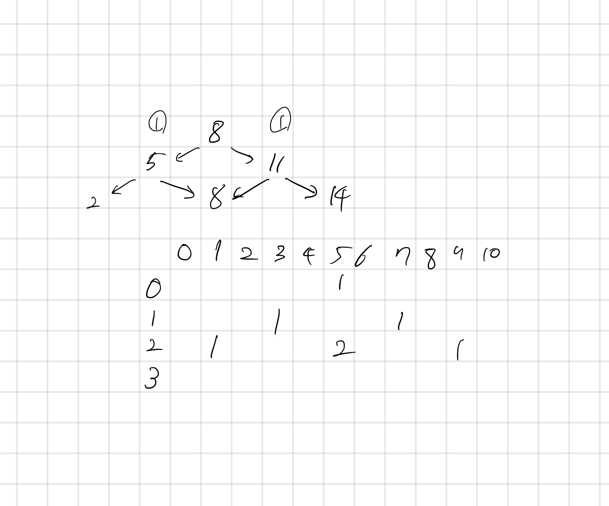

## 5557 1학년

<https://www.acmicpc.net/problem/5557>

## 내가 생각한 방법

- 이중 DP로 풀었다.
  - 숫자가 너무 크기 때문에 BFS 로는 분명히 문제 있을 거라 판단
  - 잘 떠올려서 다행이다!
- DP 세로는 턴, 가로는 숫자로 설정함
  - 초기값을 설정하기 위해 첫 번째 턴의 첫 번째 숫자를 1로 만듦 `dp[0][numbers[0]`
  - 첫 번째 턴을 순회하면서 두 번째 턴의 값을 채우기 시작함
    - 첫 번째 턴에서 숫자가 있는 칸을 발견할 경우,
    - 다음 숫자를 더하거나 뺀 값을 설정 가능한지 확인
    - 만약 설정 가능하다면 _기존에 있는 값 + 현재 값_ 을 더해서 가짓수를 구해줌
