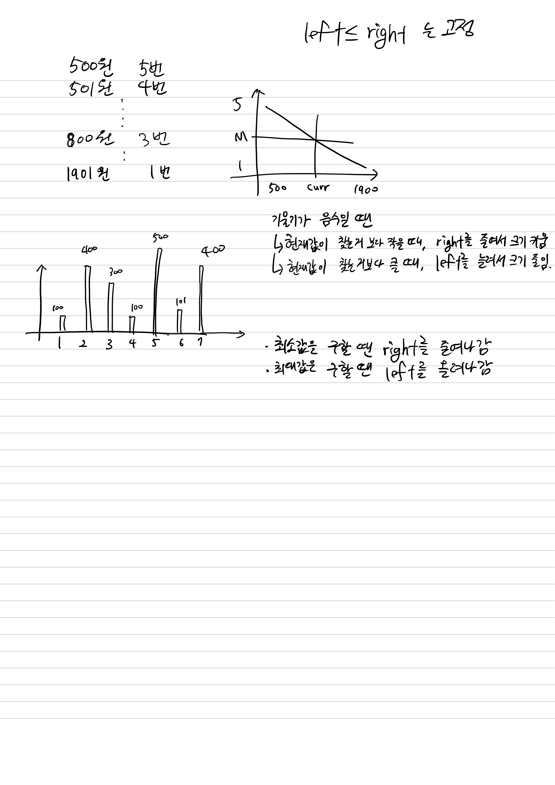

## 6236 용돈 관리

<https://www.acmicpc.net/problem/6236>

## 내가 생각한 방법

- 딱 보니 왠지 이분탐색인 듯 하다
  - 구현해보니 금액이 늘어날수록 인출 횟수가 줄어드는 기울기 음수의 함수
- 그에 맞추어 이분탐색 구현
  - 크면 오른쪽 줄이고, 작으면 왼쪽 늘리기
  - 최소값은 오른쪽 줄이고, 최대값은 왼쪽 늘리기
