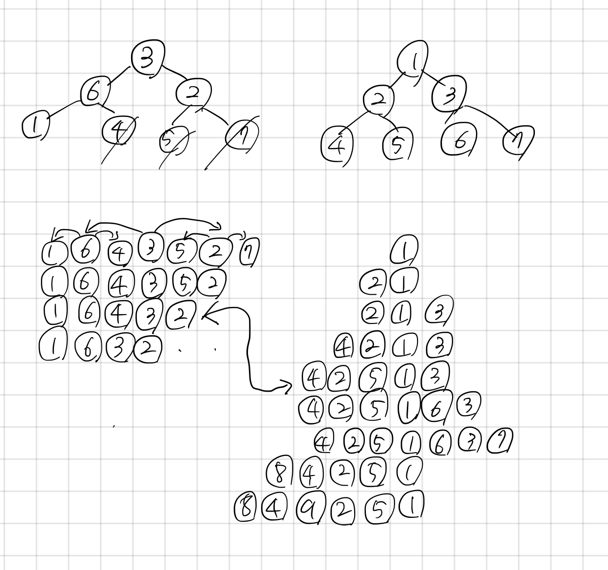

## 9934 완전 이진 트리

<https://www.acmicpc.net/problem/9934>

## 내가 생각한 방법

- 일단 `[1, 2, 3, ...]` 처럼 순서를 적어놓은 트리가 어떤 순서로 배열되는지를 알기 위해 `tree` 함수를 구현
  - 좌측, 현재, 우측 값을 순서대로 알아 내야하는데 이때 재귀를 사용(맥시멈 2^10이어서 ㄱㅊㄱㅊ)
  - 그렇게 해서 길이 N의 배열이 올 때, 어떤 순서로 들어가는지를 알아냈음
- 그 후 실제 인풋으로 들어온 배열을 순서와 레벨에 맞게 배열해줌
- 인덱스랑 실제 값이랑 헷갈려서 중간에 뇌정지 올 뻔
